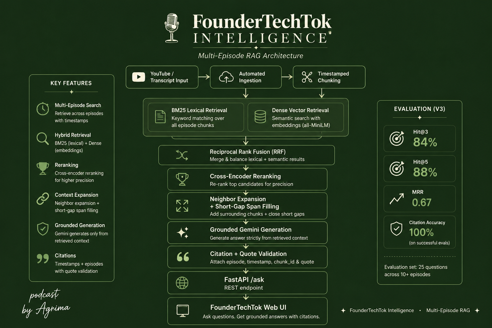

# FounderTechTok Intelligence

**A multi-episode Retrieval-Augmented Generation (RAG) system for turning FounderTechTok podcast conversations into a searchable, citation-grounded knowledge base.**

FounderTechTok Intelligence lets users ask natural-language questions across podcast episodes and retrieves relevant evidence from the original conversations before generating an answer.

Rather than treating podcast episodes as isolated long-form content, the project converts the FounderTechTok archive into a structured intelligence layer that can search across guests, topics, and conversations.

---

## Product

A user can ask:

> How do salespeople build trust with customers?

or:

> How did user feedback influence Strika's expansion beyond North America?

or even:

> What did FounderTechTok guests say about nuclear fusion?

FounderTechTok Intelligence searches the podcast archive, identifies the strongest supporting transcript evidence, and either:

- generates a grounded answer with source metadata and timestamps, or
- abstains when the archive does not contain sufficient evidence.

The goal is not to produce the most plausible answer.

The goal is to produce the most defensible answer from the FounderTechTok archive.

---

## Architecture



The system consists of four major layers:

```text
Podcast Episodes
        │
        ▼
Transcript Ingestion
        │
        ▼
Timestamp-Aware Chunking
        │
        ▼
Embedding + Vector Indexing
        │
        ▼
┌─────────────────────────────────────┐
│             RETRIEVAL               │
│                                     │
│   BM25 Search      Vector Search    │
│       │                 │           │
│       └───────┬─────────┘           │
│               ▼                     │
│      Reciprocal Rank Fusion         │
│               │                     │
│               ▼                     │
│      Cross-Encoder Reranking        │
└───────────────┬─────────────────────┘
                │
                ▼
         Context Expansion
                │
                ▼
        Evidence Selection
                │
                ▼
┌─────────────────────────────────────┐
│            GENERATION               │
│                                     │
│       Grounded LLM Generation       │
│               │                     │
│      Answer / Abstention            │
│               │                     │
│     Citations + Timestamps          │
└───────────────┬─────────────────────┘
                │
                ▼
             FastAPI
                │
                ▼
        FounderTechTok UI
```

---

# Why I Built This

Podcast archives contain a large amount of useful information, but most of that information is difficult to retrieve after an episode has been published.

A traditional podcast interface is optimized for listening.

It is not optimized for questions such as:

> What patterns have founders mentioned about early customer feedback?

or:

> How have different guests described using AI in their businesses?

FounderTechTok Intelligence explores a different interface for podcast knowledge:

```text
Listen to episodes
        ↓
Structure conversations
        ↓
Retrieve evidence
        ↓
Ask questions
        ↓
Synthesize insights
```

The project is therefore both a RAG engineering system and an experiment in turning long-form conversations into queryable knowledge.

---

# How It Works

## 1. Multi-Episode Ingestion

FounderTechTok transcripts are ingested into a common processing pipeline.

Each episode retains metadata including information such as:

```json
{
  "episode_id": "episode_08",
  "episode_title": "...",
  "guest": "...",
  "start_time": "18:01",
  "end_time": "18:33",
  "chunk_id": "episode_08_chunk_027",
  "text": "..."
}
```

Keeping episode and timestamp metadata attached to every chunk is important because retrieval alone is not enough.

The system must also be able to trace evidence back to its original conversation.

---

## 2. Timestamp-Aware Chunking

Podcast transcripts are split into smaller retrieval units.

Each chunk preserves:

- episode identity
- episode title
- guest
- start timestamp
- end timestamp
- chunk ID
- transcript text

The resulting multi-episode corpus currently contains hundreds of searchable transcript chunks.

Chunking allows the retrieval system to reason over small, focused passages instead of entire podcast transcripts.

---

## 3. Dense Embeddings

Transcript chunks are converted into vector representations using:

```text
sentence-transformers/all-MiniLM-L6-v2
```

Conceptually:

```text
Transcript Chunk
       │
       ▼
Sentence Transformer
       │
       ▼
Dense Embedding
       │
       ▼
ChromaDB
```

Dense embeddings allow the system to retrieve passages based on semantic similarity even when the user's wording differs from the wording used in the podcast.

---

## 4. BM25 Lexical Retrieval

FounderTechTok Intelligence also performs lexical retrieval using BM25.

BM25 is useful for queries containing:

- names
- product names
- technical terminology
- company names
- exact phrases
- distinctive keywords

For example:

```text
Strika Europe feedback
```

may benefit heavily from exact lexical matches.

The implementation uses:

```text
rank_bm25
```

---

## 5. Vector Retrieval

In parallel with BM25, the question is embedded using the same Sentence Transformer model used during indexing.

The query embedding is compared against the persistent Chroma vector store.

```text
Question
   │
   ▼
Embedding Model
   │
   ▼
Query Vector
   │
   ▼
ChromaDB
   │
   ▼
Semantic Candidates
```

This retrieval path is useful when the relevant transcript passage expresses the same idea using different words.

---

## 6. Hybrid Retrieval

Lexical and semantic search solve different problems.

Instead of choosing one, FounderTechTok Intelligence combines both.

```text
BM25
  │
  │
  ├───────────┐
  │           │
  ▼           ▼
Lexical     Semantic
Results     Results
  │           │
  └─────┬─────┘
        ▼
       RRF
```

This gives the system access to both:

**lexical relevance**

and

**semantic relevance.**

---

## 7. Reciprocal Rank Fusion

The two retrieval rankings are merged using Reciprocal Rank Fusion (RRF).

For an item appearing at rank `r`, its contribution is approximately:

```text
1 / (k + r)
```

The implementation uses:

```text
k = 60
```

Documents that rank strongly in either retrieval system receive higher fused scores.

RRF is attractive here because it combines rankings without requiring BM25 scores and vector similarity scores to exist on the same numerical scale.

---

## 8. Cross-Encoder Reranking

Hybrid retrieval increases recall, but the first-stage ranking is not always precise enough.

The strongest hybrid candidates are therefore reranked using:

```text
cross-encoder/ms-marco-MiniLM-L-6-v2
```

The cross-encoder evaluates:

```text
(question, transcript chunk)
```

as a pair.

This allows it to perform a more computationally expensive but more precise relevance judgment on a smaller candidate set.

The pipeline therefore becomes:

```text
Large Transcript Corpus
        ↓
BM25 + Vector Retrieval
        ↓
RRF Candidate Set
        ↓
Cross-Encoder
        ↓
Best Evidence
```

---

## 9. Context Expansion

One important retrieval failure mode appeared during evaluation.

Sometimes the retriever identifies a highly relevant chunk, while the exact sentence required to answer the question appears immediately before or after it.

For example, a retrieved chunk may contain the beginning of an explanation while the actual answer continues into the neighboring transcript chunk.

FounderTechTok Intelligence therefore supports context expansion around retrieved evidence.

Conceptually:

```text
Retrieved Chunk N
        ↓
Chunk N-1
Chunk N
Chunk N+1
        ↓
Expanded Evidence Window
```

This improves evidence coverage without forcing the system to use excessively large chunks during initial retrieval.

---

# Grounded Generation

After retrieval, reranking, and context expansion, the selected transcript evidence is passed to the generation layer.

The language model is instructed to:

- answer using the supplied FounderTechTok evidence
- avoid unsupported external knowledge
- avoid inventing facts
- preserve source traceability
- cite relevant podcast timestamps
- abstain when the evidence is insufficient

Conceptually:

```text
User Question
      +
Retrieved Evidence
      +
Grounding Instructions
      │
      ▼
     LLM
      │
      ▼
Grounded Answer
```

The generation model is therefore used as a synthesis layer rather than as the system's source of truth.

---

# Abstention

A trustworthy RAG system should not answer every question.

Consider:

> What did FounderTechTok guests say about nuclear fusion?

If the archive contains no meaningful discussion of nuclear fusion, the system should not use the language model's general knowledge to manufacture an answer.

Instead, it should return an insufficient-evidence response.

Example:

```text
I don't have enough evidence in the FounderTechTok archive to answer that.
```

This keeps the system bounded by the underlying podcast corpus.

---

# Retrieval Evaluation

FounderTechTok Intelligence includes a manually constructed multi-episode evaluation benchmark.

The current benchmark contains:

```text
30 questions

25 answerable questions
5 unanswerable questions
```

Positive questions are associated with expected supporting transcript evidence.

Negative questions test whether the system can recognize queries that are unsupported by the archive.

---

## Metrics

The retrieval evaluation measures:

### Hit@1

Whether expected evidence appears in the first retrieved result.

### Hit@3

Whether expected evidence appears anywhere in the first three results.

### Hit@5

Whether expected evidence appears anywhere in the first five results.

### Mean Reciprocal Rank

MRR rewards systems that place the first relevant result as high as possible.

For a question whose first relevant result appears at rank `r`:

```text
Reciprocal Rank = 1 / r
```

MRR is the average reciprocal rank across the positive evaluation questions.

---

# Current Retrieval Results

A baseline configuration produced:

```text
Hit@1: 0.52
Hit@3: 0.72
Hit@5: 0.80
MRR:    0.6313
```

Increasing candidate retrieval depth improved performance:

```text
Hit@1: 0.52
Hit@3: 0.84
Hit@5: 0.88
MRR:    0.6700
```

Therefore, the current best measured retrieval configuration achieves:

| Metric | Score |
|---|---:|
| Hit@1 | 52% |
| Hit@3 | 84% |
| Hit@5 | 88% |
| MRR | 0.67 |

These numbers are reported on the current 25-question positive retrieval benchmark.

They should be interpreted as development benchmark results rather than general claims about performance on arbitrary podcast questions.

---

# Retrieval Error Analysis

Evaluation was also used to inspect retrieval failures instead of treating the benchmark as a single aggregate number.

Several misses revealed that the relevant evidence was located in neighboring chunks around a retrieved passage.

This motivated context expansion.

For difficult evaluation cases, expanded context successfully surfaced expected supporting chunks that were absent from the original final ranking.

This is an important distinction:

```text
Retrieval miss
≠
No useful local evidence
```

Sometimes the retrieval system identifies the correct conversational region but not the exact chunk containing the answer.

Context expansion addresses that failure mode.

---

# Generation Evaluation

The evaluation framework is designed to separately measure retrieval and generation.

Generation-related checks include:

- answerability
- abstention behavior
- citation correctness
- groundedness
- latency
- API reliability

A generation evaluation run was attempted across the 30-question benchmark.

However, the external Gemini API quota was exhausted during the run, producing HTTP `429 RESOURCE_EXHAUSTED` responses for most requests.

Only one request completed successfully in that run.

Because of this, generation metrics from that run are **not treated as meaningful final benchmark results**.

This distinction is intentional.

API failure should not be reported as model-quality failure, and a one-request sample should not be presented as reliable generation accuracy.

The retrieval benchmark remains independently measurable because retrieval is performed locally.

---

# Generation Caching and Resumability

Generation evaluation can involve external API calls that are:

- rate limited
- quota constrained
- slower than retrieval
- potentially costly

The evaluation pipeline therefore supports generation caching and resumable execution.

Previously completed generation results can be reused instead of repeatedly calling the model for the same benchmark question.

This separates:

```text
retrieval experimentation
```

from:

```text
external LLM availability
```

and makes evaluation more reproducible.

---

# API

FounderTechTok Intelligence exposes the RAG pipeline through a FastAPI application.

The API includes:

```text
GET  /
GET  /health
POST /ask
```

Interactive API documentation is automatically available through FastAPI's Swagger interface when the server is running.

---

## Example Request

```json
{
  "question": "How do salespeople build trust with customers?"
}
```

The response includes fields for information such as:

```json
{
  "question": "...",
  "status": "...",
  "answer": "...",
  "citations": [],
  "retrieval_latency_sec": 0.0,
  "generation_latency_sec": 0.0,
  "total_latency_sec": 0.0,
  "retrieved_chunk_count": 0,
  "expanded_context_count": 0
}
```

Exact values depend on retrieval results and generation availability.

---

# Web Interface

The project also includes a lightweight browser interface for querying the system.

The frontend communicates with the FastAPI `/ask` endpoint.

The interface is designed around the FounderTechTok visual identity while keeping the interaction intentionally simple:

```text
Ask a question
      ↓
Search FounderTechTok
      ↓
Retrieve podcast evidence
      ↓
Generate grounded response
      ↓
Display answer + sources
```

Frontend files are stored under:

```text
static/
```

---

# Running the Project

## 1. Clone the Repository

```bash
git clone <repository-url>
cd foundertechtok-intelligence
```

---

## 2. Create a Virtual Environment

```bash
python3 -m venv .venv
source .venv/bin/activate
```

On Windows:

```bash
.venv\Scripts\activate
```

---

## 3. Install Dependencies

```bash
pip install -r requirements.txt
```

---

## 4. Configure Environment Variables

Generation requires a Gemini API key.

Set it through your environment rather than committing credentials to the repository.

For example:

```bash
export GEMINI_API_KEY="your-api-key"
```

Never commit API keys to Git.

---

## 5. Start the API

From the project root:

```bash
uvicorn src.api:app --host 0.0.0.0 --port 8000 --reload
```

Once the application starts, the API is available locally at port `8000`.

FastAPI documentation is available at:

```text
/docs
```

---

# Project Structure

```text
foundertechtok-intelligence/
│
├── data/
│   ├── evaluation/
│   ├── processed/
│   └── transcripts/
│
├── docs/
│   └── architecture.png
│
├── src/
│   ├── api.py
│   ├── batch_ingest.py
│   ├── bm25_search.py
│   ├── build_eval_dataset.py
│   ├── build_multi_episode_vector_store.py
│   ├── build_vector_store.py
│   ├── chunk_transcript.py
│   ├── chunk_with_timestamps.py
│   ├── create_embeddings.py
│   ├── evaluate_multi_rag.py
│   ├── evaluate_rag.py
│   ├── hybrid_rag.py
│   ├── hybrid_search.py
│   ├── load_transcript.py
│   ├── manual_ingest.py
│   ├── multi_episode_chunk.py
│   ├── multi_episode_rag.py
│   ├── multi_episode_search.py
│   ├── query_vector_store.py
│   ├── rag_answer.py
│   ├── rerank_results.py
│   ├── save_chunks.py
│   ├── semantic_search.py
│   ├── test_gemini.py
│   └── youtube_ingest.py
│
├── static/
│   └── index.html
│
├── .gitignore
├── README.md
└── requirements.txt
```

---

# Tech Stack

### Retrieval

- BM25
- Sentence Transformers
- ChromaDB
- Reciprocal Rank Fusion

### Ranking

- Cross-Encoder reranking
- `cross-encoder/ms-marco-MiniLM-L-6-v2`

### Embeddings

- `all-MiniLM-L6-v2`

### Generation

- Gemini
- evidence-constrained prompting
- abstention handling
- timestamp-grounded citations

### Backend

- Python
- FastAPI
- Uvicorn

### Frontend

- HTML
- CSS
- JavaScript

### Evaluation

- Hit@K
- Mean Reciprocal Rank
- answerability checks
- abstention evaluation
- citation validation
- generation caching
- latency tracking
- API error tracking

---

# Engineering Decisions

Several design decisions are intentional.

## Hybrid Retrieval Instead of Vector Search Alone

Embeddings are strong at semantic similarity but can miss exact names and terminology.

BM25 handles lexical matching well.

Combining both provides a stronger candidate pool.

---

## Reranking Instead of Sending Every Retrieved Chunk to the LLM

Sending a large amount of weakly relevant context to the generation model increases noise and cost.

The cross-encoder acts as a second-stage relevance filter.

---

## Small Retrieval Chunks + Context Expansion

Large chunks improve context but reduce retrieval precision.

Very small chunks improve retrieval precision but may split an answer across boundaries.

The system therefore retrieves focused chunks first and expands around promising evidence afterward.

---

## Retrieval and Generation Are Evaluated Separately

A RAG system can fail because:

```text
retrieval failed
```

or because:

```text
generation failed
```

or because:

```text
the external API failed
```

These are different failure modes.

The evaluation framework keeps them separate instead of collapsing everything into one opaque accuracy number.

---

## Abstention Is a Feature

The system is not optimized to answer every question.

It is optimized to answer questions that can be supported by the archive.

A correct refusal is preferable to a fluent hallucination.

---

# Current Limitations

FounderTechTok Intelligence is still an experimental system.

Current limitations include:

### Small Evaluation Dataset

The current benchmark contains 30 manually constructed questions.

That is sufficient for development and error analysis but not enough to establish broad statistical performance.

### Corpus Size

The indexed FounderTechTok archive is still relatively small compared with large production knowledge bases.

Retrieval behavior may change as the number and diversity of episodes increase.

### External Generation Dependency

Generation depends on an external LLM API.

Rate limits, quota exhaustion, latency, and model changes can affect generation availability.

### Retrieval Threshold Calibration

Determining whether retrieved evidence is sufficiently strong for generation remains an important RAG problem.

Abstention behavior can be improved through better confidence calibration.

### Transcript Quality

Retrieval quality ultimately depends on transcript quality.

Automatic transcription errors, speaker ambiguity, and timestamp boundaries can affect evidence retrieval.

### Benchmark Construction

Evaluation labels are manually created and therefore require careful validation.

Some questions can legitimately be supported by multiple neighboring transcript regions.

---

# Roadmap

Potential next iterations include:

- expand the indexed FounderTechTok archive
- build a larger held-out benchmark
- improve confidence calibration
- tune retrieval depth automatically
- improve abstention thresholds
- add metadata-aware filtering
- add guest-level filtering
- add episode-level filtering
- improve transcript normalization
- experiment with query rewriting
- evaluate alternative embedding models
- evaluate alternative rerankers
- measure Recall@K and nDCG
- add human evaluation
- improve citation validation
- add conversational follow-up questions
- build cross-episode synthesis
- identify recurring themes across guests
- add topic clustering
- link citations directly to podcast playback timestamps
- containerize the application
- deploy the API and frontend
- add automated ingestion for new FounderTechTok episodes

---

# Long-Term Direction

The broader goal is to move from:

```text
Podcast Archive
```

to:

```text
Podcast Knowledge System
```

As the FounderTechTok corpus grows, questions can become increasingly cross-episode:

> What patterns do founders describe when talking about their first users?

> How are different guests using AI to change their workflows?

> Where do founders disagree about product-market fit?

> What recurring lessons appear across FounderTechTok conversations?

The system can then retrieve evidence from multiple guests, synthesize recurring themes, compare perspectives, and keep every conclusion traceable to the original conversations.

---

# Status

**FounderTechTok Intelligence — multi-episode RAG prototype with retrieval evaluation, grounded generation, FastAPI serving, and a branded web interface.**

Current retrieval benchmark:

```text
Questions: 30
Positive retrieval questions: 25
Negative questions: 5

Hit@1: 52%
Hit@3: 84%
Hit@5: 88%
MRR:    0.67
```

Generation evaluation infrastructure is implemented, but final generation-quality metrics are intentionally not reported from the latest run because external Gemini API quota exhaustion prevented a sufficiently complete evaluation.

---

## FounderTechTok

FounderTechTok Intelligence is built on top of conversations from **FounderTechTok**, a podcast exploring founders, technology, products, AI, and the decisions behind building companies.

The intelligence layer turns those conversations into structured, searchable evidence.

**From conversations → retrieval → intelligence.**